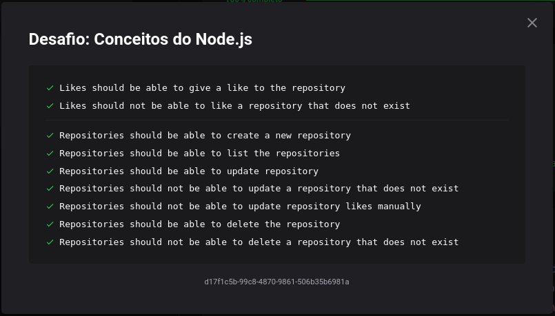
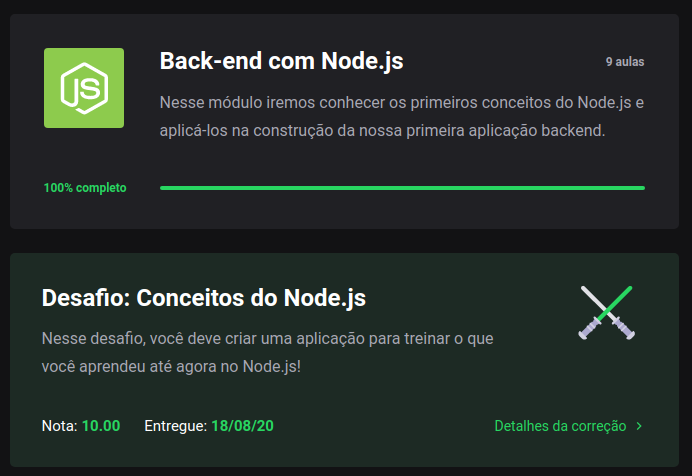

<h1 align="center">
  Desafio 02: Conceitos NodeJS
</h1>

<blockquote align="center">“Não espere para plantar, apenas tenha paciência para colher”!</blockquote>

## Sobre o desafio 💪
Primeiro desafio técnico do GoStack 13.0! 🚀  
Fizemos uma API simples com NodeJS para comprovar que entendemos os conceitos do NodeJS que foi explicado nas primeiras aulas do bootcamp 📚  
Foi usado o Jest (uma estrutura de testes criada pelo Facebook) para realizar os testes e ver se passamos no desafio, os testes eram os seguintes 🛠  
</img>
Para mais detalhes sobre o desafio e que era precisa ser feito para ser passado em cada teste, você pode ver neste <a href="https://github.com/rocketseat-education/bootcamp-gostack-desafios/tree/master/desafio-conceitos-nodejs">link</a>.

## 9/9 Testes Concluídos 🎯
Consegui passar em todos, e isso me garantiu uma nota 10.00 nesse desafio. 😀
</img>
